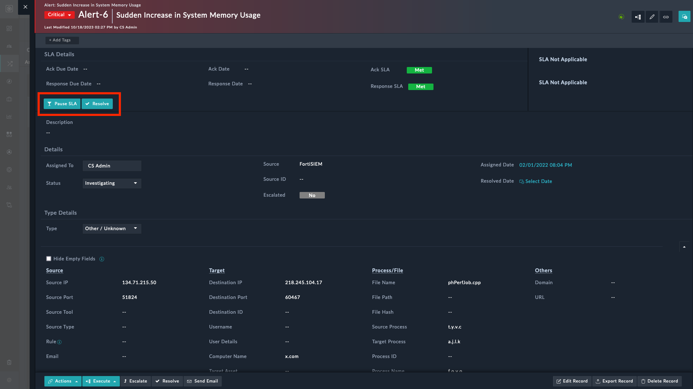
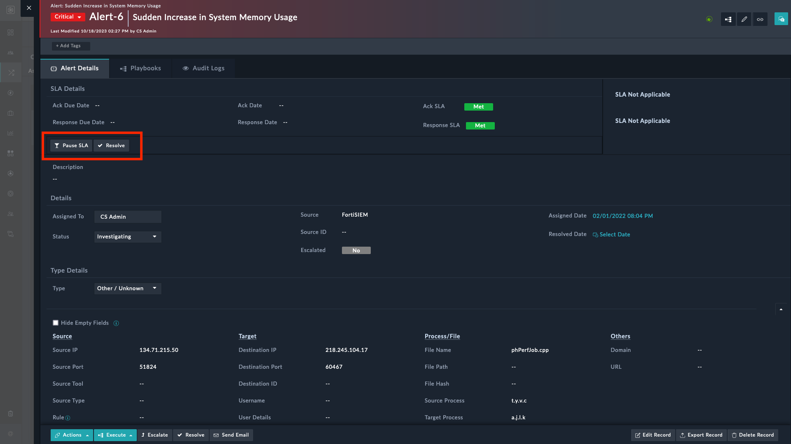

# Release Information

- **Version**: 1.0.1

- **Certified**: Yes

- **Publisher**: Fortinet  

- **Compatibility**: 7.4.3 and later

- **Applicable**: View Panel

- [**Release Notes**](./release_notes.md)

# Overview

The **Playbook Buttons** widget is a powerful tool designed to streamline your workflow. Here's what it does:

1. **Button Creation**: It allows you to create custom buttons directly on a record's detail view.
2. **Playbook Execution**: When users click these buttons, they trigger associated playbooks, automating specific tasks.
3. **Context-Aware Display**: The widget intelligently displays relevant playbooks based on the selected record type and associated filter conditions. For instance, if the record is an *Alert*, you may see playbooks like:

    - **Alert - Escalate To Incident**
    - **Cascade Permissions to all Related Records**
    - **Create Communication Record (Alert)**
    - **Extract Indicators - Manual**
    - **Link Similar Alerts**
    - **Pause SLA - Alerts**
    - **Resolve Alert**

4. **Monitoring Progress**: Keep track of playbook execution progress using the *Playbook Execution Wizard*.

In summary, the **Playbook Buttons** widget empowers you to take swift, context-aware actions within FortiSOAR&trade;.

The following image displays executable playbooks as buttons:

|||
|:--:|:--:|
|Playbooks as primary buttons|Playbooks as secondary buttons|

## Next Steps

| [Installation](./docs/setup.md#installation) | [Configuration](./docs/setup.md#configuration) | [Usage](./docs/usage.md) |
|----------------------------------------------|------------------------------------------------|--------------------------|
