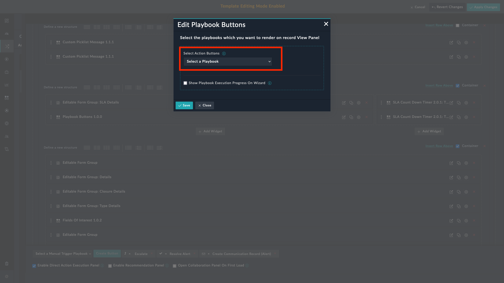
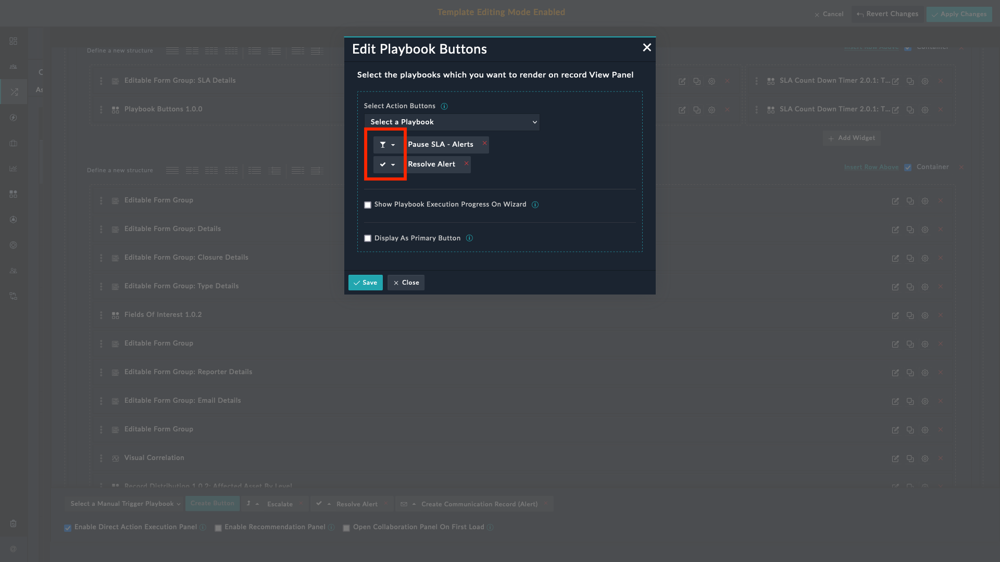
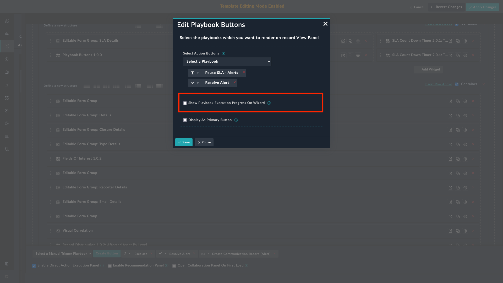
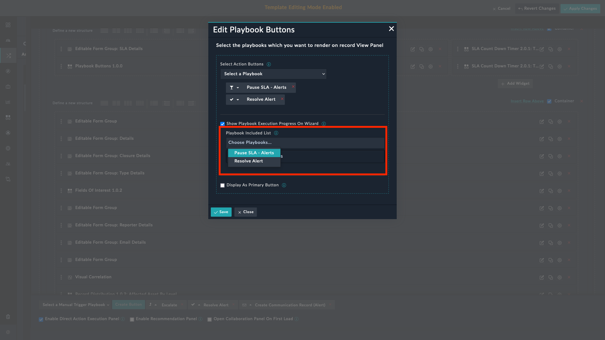
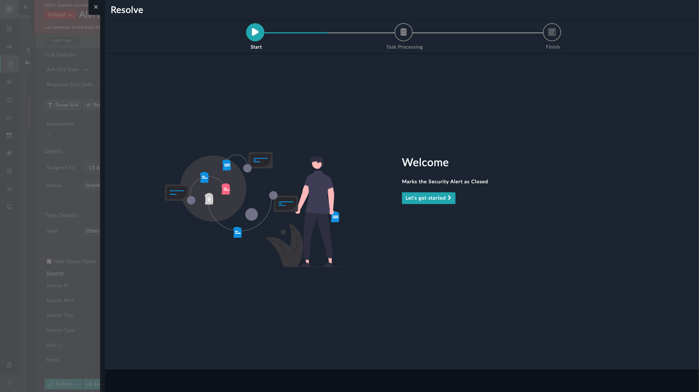
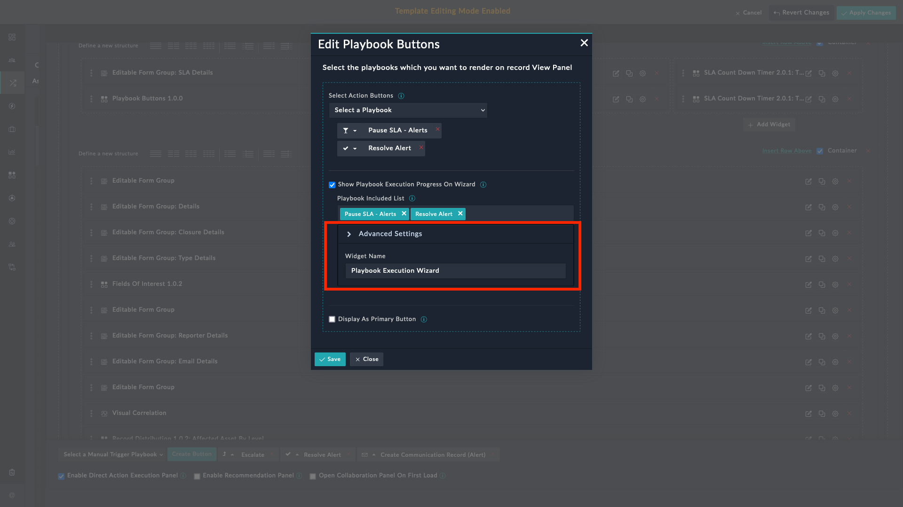
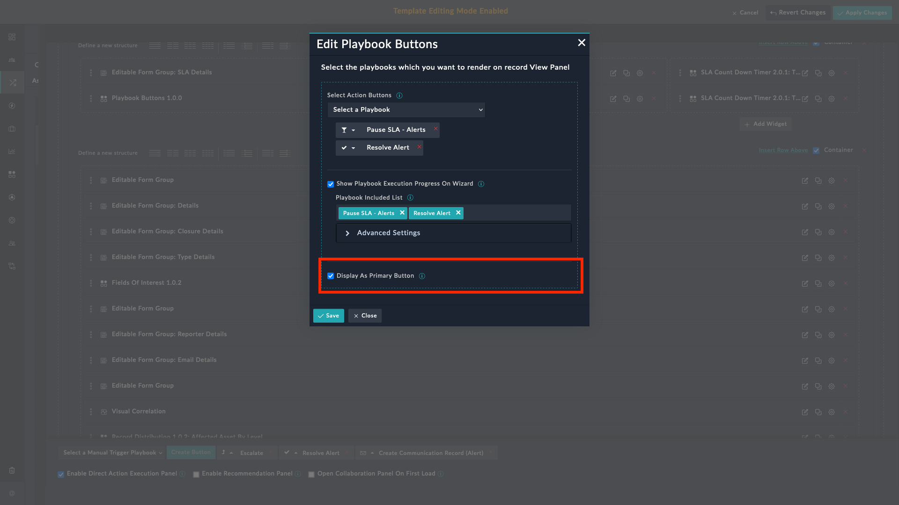

| [Home](../README.md) |
|----------------------|

# Usage

The **Playbook Buttons** widget adds playbooks as separate buttons on a records detailed view that can be executed directly from the records' view panel.

## Editing the Playbooks Button Widget

1. Edit a record's view template and select **Add Widget** button.

2. Select **Playbook Buttons** from the list to bring up the **Playbook Buttons** widget's edit view.

3. Select playbooks from the **Select Action Buttons** field. You can select multiple playbooks.

    

4. Assign an icon to each selected playbook.

    

5. Select **Show playbook execution progress on wizard** to get real-time progress updates as playbooks run. Install **Playbook Execution Wizard** to view playbook execution progress.

    

6. Select the playbooks to execute from the **Playbook Included List**. The drop-down lists only the playbooks associated with the playbook selected in **Select Action Buttons** field.

    

    The following screen shows the playbook execution wizard about to show the playbook execution progress.

    

7. Specify the widget to launch when displaying the playbook execution progress under **Advanced Settings**. Currently, only **Playbook Execution Wizard** is supported in this field.

    

8. Select the checkbox **Display as Primary Button** to display the playbooks as primary buttons.

    

The following screen shows an alert record when playbook buttons are primary, and when they are set as secondary.

|||
|:--:|:--:|
|Playbooks as primary buttons|Playbooks as secondary buttons|

## Next Steps

| [Installation](./setup.md#installation) | [Configuration](./setup.md#configuration) |
|-----------------------------------------|-------------------------------------------|